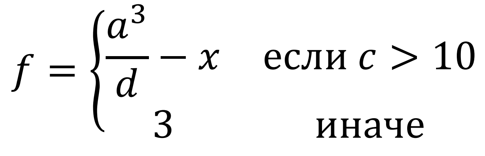

# Лабораторная работа по теме: "Программирование ветвлений и итерационных циклов"

## Цель работы
Изучение средств и приемов программирования ветвлений и итерационных циклов на языке ассемблера.

## Задание
Разработать программу на языке ассемблера, вычисляющую *целочисленное* выражение:

