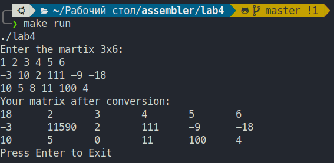

# Лабораторная работа по теме: "Обработки массивов и матриц"

## Цель работы
Изучение приемов моделирования обработки массивов и матриц в языке ассемблера.

## Задание
Дана матрица 3х6. Определить произведение элементов кратных 3 в каждой строке и поместить на место элемента, номер которого совпадает с номером строки.
Организовать вывод матрицы и вывод результата.

## Пример работы
